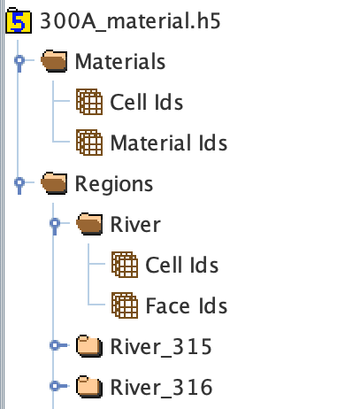
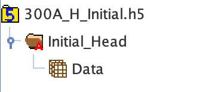
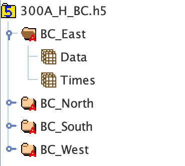
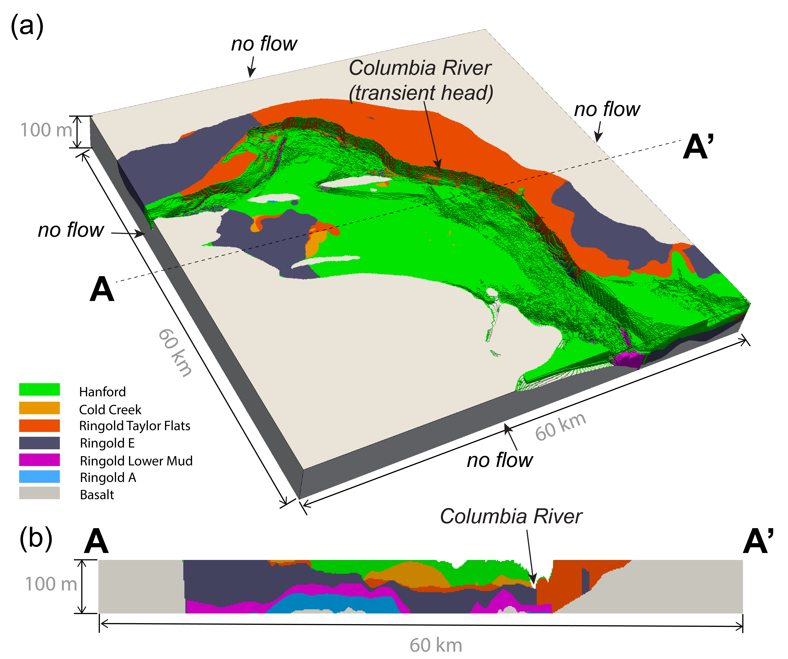
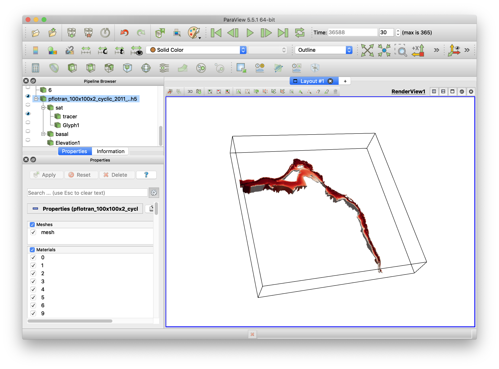
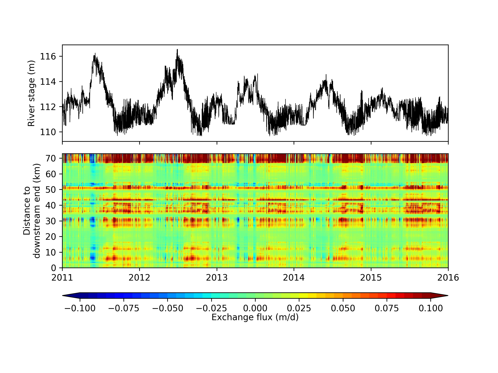
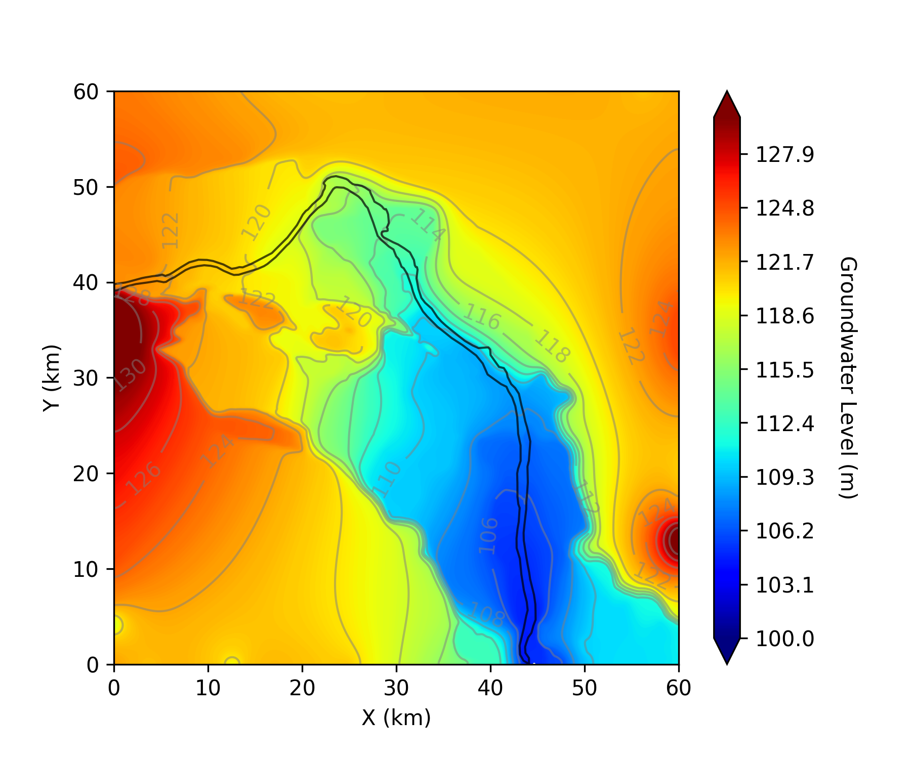
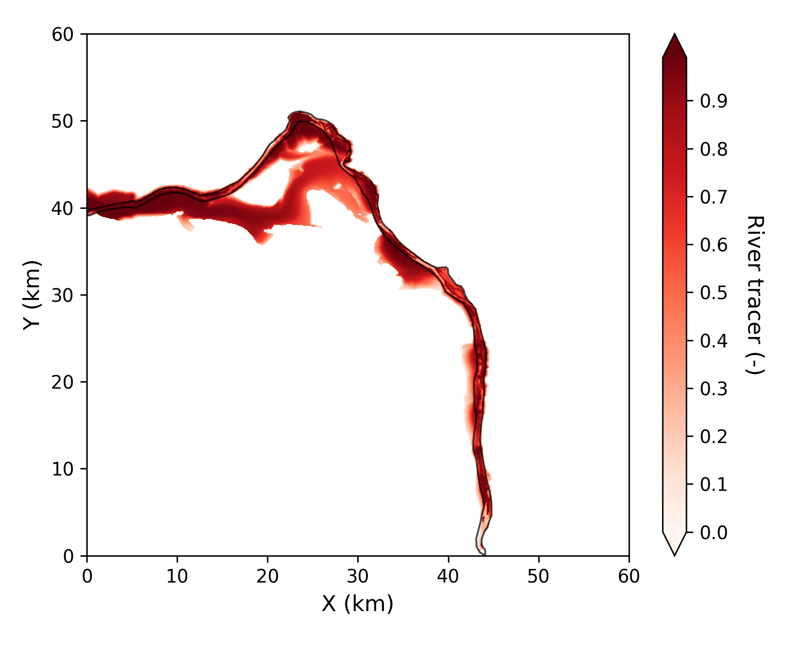
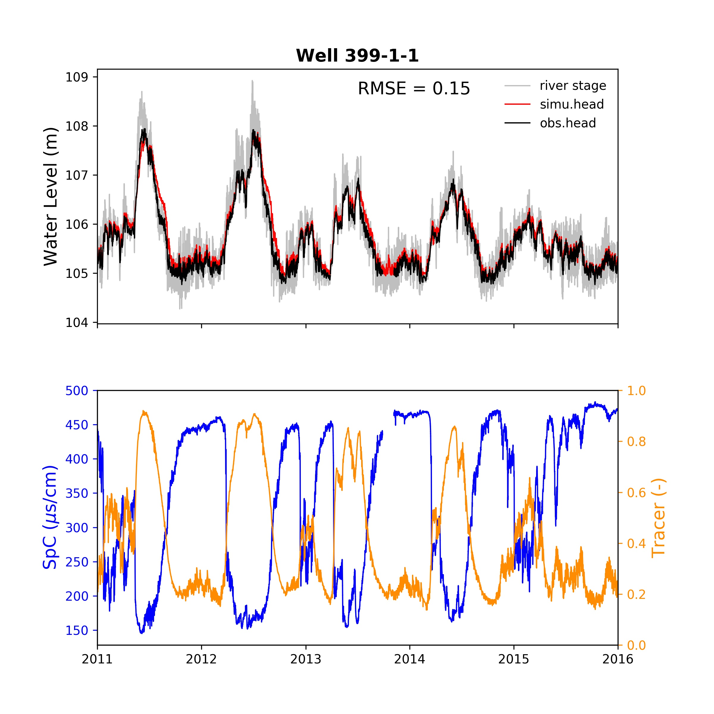

<a id='top'></a>

# Workflow for simulations in PFLOTRAN

The following workflow provides some guidance on running flow and transport model using [PFLOTRAN](https://www.pflotran.org/). This workflow has been used to generate a reach scale flow and transport model for the Hanford Reach, Washington. The simulation results have recently been published in Water Resources Research. 

**Shuai, P.**, X. Chen, X. Song, G. Hammond, J. Zachara, P. Royer, H. Ren, W. Perkins, M. Richmond, M. Huang (2018). Dam Operations and Subsurface Hydrogeology Control Dynamics of Hydrologic Exchange Flows in a Regulated River Reach. *Water Resources Research*. https://doi.org/10.1029/2018WR024193

*Software needed in the workflow*: [Jupyter Notebook](https://jupyter.org), [Paraview](https://www.paraview.org), [HDFView](www.hdfgroup.org)

## Table of Contents

* [Model pre-processes](#pre-process)
    * [Model inputs](#inputs)
    * [Import geoframework](#import-geoframework)
    * [Generate material ids and river faces](#material-river-face)
    * [Generate initial head and inland boundary](#initial-head)
    * [Generate river boundary](#river-bc)
* [PFLOTRAN input deck](#input_deck)
* [Submit and run jobs on NERSC](#submit-and-run)
* [Post-processes](#post-process)
    * [Visulization in Paraview](#plot-in-paraview)
    * [Plot flux across riverbed from mass balance output](#plot-flux-from-massbalance)
    * [Plot flux across riverbed from river cells](#plot-flux-from-river-cells)
    * [Plot groundwater level](#plot-wl)
    * [Plot groundwater age](#plot-age)
    * [Plot solute contour](#plot-solute)
    * [Plot simulation against observation](#plot-simu-obs)    
* [Miscellaneous](#miscellaneous)
    * [Import data using SQL](#sql)
    * [Plot groundwater chemistry data](#plot-chem)
    * [Batch process figures in ImageMagick](#imagemagick)
    * [Spectral analysis](#spectral)
    * [Rewrite HDF5](#h5)


<a id='pre-process'></a>
### Model pre-processes
Run [PFLOTRAN_preprocesses.ipynb](PFLOTRAN_preprocesses.ipynb) to configurate model setup (model domain, parameters, inital conditions and boundary conditions and etc.) This Jupyter Notebook uses R as the kernel.

<a id='inputs'></a>
#### Model inputs
This section gathers model parameters such as dimension, coordinates for the structured grids.

<a id='import-geoframework'></a>
#### Import geoframework
This section gathers the geologic framework for the model. Each geologic layer is an Ascii file that contains the topography for each geologic unit. It can be interpolated to the model grids.

<a id='material-river-face'></a>
#### Generate material ids and river faces
This section generates material id for each grid cell and finds the river boundary cells (where river stage is applied).
**Output**: `Material.h5`

A sample material ids are listed below. Please note id = 0 is reserved for inactive cells.

|**Material id**|**Unit**|
|-----------|-----|
|0|Inactive cells|
|1|Hf|
|2|Cc|
|3|Rtf|
|4|Re|
|5|Rlm|
|6|Ra|

||
|----|
|*A snapshot of the `Material.h5`*|

<a id='initial-head'></a>
#### Generate initial head and inland boundary
This section generates the initial head over the domain and the head boundary at model bounds.
**Output**: `Initial.h5` and `BC.h5`

||
|----|
|*A snapshot of the `Initial.h5`*|

||
|----|
|*A snapshot of the `BC.h5`*|

<a id='initial-head'></a>
#### Generate river boundary
This section generates transient river stage boundary. 
**Output**: `Gradient.txt` and `Datum.txt`

*Note: the default time unit in external file is in seconds. You can change the time unit by specifying TIME_UNITS hr as the header in .txt file.* See this [example](https://www.pflotran.org/documentation/user_guide/cards/pages/rank_three.html#rank-three).

An example of the `Gradient.txt` (header should not go into the .txt file):

|*time (sec)*|*grad_x*|*grad_y*|*grad_z*|
|:--:|:--:|:--:|:--:|
|0.|4E-05|4E-05|0|

An example of the `Datum.txt` (header should not go into the .txt file):

|*time (sec)*|*x*|*y*|*z (stage)*|
|:--:|:--:|:--:|:--:|
|0.|1000|2000|105.6|

||
|----|
|*Figure showing model domain*|

<br/>
<div align="right">
    <b><a href="#top">↥ back to top</a></b>
</div>
<br/>

[/]:# (hidden comment)

[/]:# ([return to the top](#top))

<a id='input_deck'></a>
### PFLOTRAN input deck
Run [PFLOTRAN_input_deck.ipynb](PFLOTRAN_input_deck.ipynb) to generate PFLOTRAN input deck for the model. This notebook uses `R` as the kernel. Right now, the `sink` and `cat` function do not work properly in Jupyter Notebook. The alternative is to export this notebook as `R script`, and use `Rstudio` to execute. 

A set of parameters can be set: `model run time, timestep, hydraulic properties, river conductance, observation wells, output variables and file format and etc.` A sample pflotran input deck can be found [here](https://www.pflotran.org/documentation/user_guide/how_to/simple_flow_problem.html#simple-flow-problem).
**Output**: `pflotran.in`

A sample hydraulic properties are listed below:

| Unit | Permeability ($m^{2}$) | Hydraulic conductivity ($m/d$) |
|------|:---------------:|-------------:|
|Hanford (Hf)|7e-09| 7000|
|Cold Creek (Cc)|1e-10|100|
|Ringold Taylor Flats (Rtf)|1e-12|1|
|Ringold E (Re)|4e-11|40|
|Ringold Lower Mud (Rlm)|1e-12|1|
|Ringold A (Ra)|1e-12|1|

[return to the top](#top)

<a id='submit-and-run'></a>
### Submit and run jobs on NERSC
[run_job_on_NERSC.ipynb](run_job_on_NERSC.ipynb) has some batch script to submit, monitor and modify jobs on NERSC.

An example batch script:

```bash
#!/bin/bash -l

#SBATCH -A m1800
#SBATCH -N 171
#SBATCH -t 48:00:00
#SBATCH -L SCRATCH  
#SBATCH -J job_name
#SBATCH --qos regular
#SBATCH --mail-type ALL
#SBATCH --mail-user <user_email>

cd $SLURM_SUBMIT_DIR

srun -n 4096 /global/project/projectdirs/pflotran/pflotran-edison/src/pflotran/pflotran -pflotranin pflotran.in
```
[return to the top](#top)

<a id='post-process'></a>
### Post-processes 
This section has some `python` script for post-processing data from PFLOTRAN outputs and generate plots.

<a id='plot-in-paraview'></a>
#### Visulization in Paraview
[Paraview](https://www.paraview.org/) can be easily used to open PFLOTRAN output `HDF5` file (i.e. `pflotran.h5`). It visulizes the model in 3-D and can be used to export plots and animations. For detailed instruction, please take a look at [Paraview manual](https://www.paraview.org/paraview-guide/). 


||
|:----:|
|*A snapshot of Paraview*|

[return to the top](#top)

<a id='plot-flux-from-massbalance'></a>
#### Plot flux across riverbed from mass balance output 
Run [NERSC-plot_flux_from_massBalance.ipynb](NERSC-plot_flux_from_massBalance.ipynb) to generate flux heat map, net gaining and flux snapshots.

||
|:----:|
|*Flux heat map generated from the notebook*|

<a id='plot-flux-from-river-cells'></a>
#### Plot flux across riverbed from river cells
Run [NERSC-plot_flux_from_river_cells.ipynb](NERSC-plot_flux_from_river_cells.ipynb) to pre-process h5 outputs and generate absolute exchange bar plots.

||
|:----:|
|*Flux plot generated from the notebook*|

<a id='plot-wl'></a>
#### Plot groundwater level
Run [NERSC-plot_gw_level.ipynb](NERSC-plot_gw_level.ipynb) to generate groundwater level contours.

||
|:----:|
|*Groundwater contour plot generated from the notebook*|

<a id='plot-age'></a>
#### Plot groundwater age
Run [NERSC-plot_gw_age.ipynb](NERSC-plot_gw_age.ipynb) to generate groundwater age contours.

<a id='plot-solute'></a>
#### Plot solute contour
Run [NERSC-plot_solute_contour.ipynb](NERSC-plot_solute_contour.ipynb) to generate solute concentration plots.

||
|:----:|
|*Groundwater tracer plot generated from the notebook*|

<a id='plot-simu-obs'></a>
#### Plot simulation against observation
Run [NERSC-plot_simu_obs_well_data.ipynb](NERSC-plot_simu_obs_well_data.ipynb) to generate tracer breakthough curves.

||
|:----:|
|*Tracer BTC against observation data plot generated from the notebook*|

[return to the top](#top)

<a id='miscellaneous'></a>
### Miscellaneous
Other notebooks that are used for post-processing.

<a id='sql'></a>
#### Import data using SQL
* Run [HEIS_data_retriever.ipynb](HEIS_data_retriever.ipynb) to retrive **well data** from HEIS. The common database names are listed here:

|Table name| Description|
|----------|------------|
|pflow.GW_SAMPLE_RESULTS_MV|HEIS--ALL groundwater chemistry data|
|pflow.well_construction_mv|HEIS--well construction data, includes depth, casing, and other fields|
|pflow.HYDRAULIC_HEAD_MV|HEIS--manual water level data|
|pflow.tblWells|HEIS--AWLN well information|
|pflow.tblProcessedData|HEIS--AWLN raw data (hourly)|
|pflow.vAwln|a view of Awln data that includes Hanford well names|

note: table name above begin with "v" indiates it is a view that Patrick created and it is not a token from HEIS, rather , it is a query based on the HEIS database.

* Run external GIS application (ArcGIS/QGIS) to retrive **GIS data** (such as well locations, geologic units and plumes) using PostgreSQL/PostGIS access.

<a id='plot-chem'></a>
#### Plot groundwater chemistry data
* Run [NERSC-plot_GW_chemical_dataset.ipynb](NERSC-plot_GW_chemical_dataset.ipynb) to analyze groundwater chemistry data downloaded from HEIS.

<a id='imagemagick'></a>
#### Batch process figures in ImageMagick
* Run [ImageMagic.ipynb](ImageMagic.ipynb) to batch process figures using [ImageMagic](https://www.imagemagick.org/).

<a id='spectral'></a>
#### Spectral analysis
* Run [river_stage_flux_spectral_analysis.ipynb](river_stage_flux_spectral_analysis.ipynb) to use spectral analysis (`FFT` and `Wavelet`) in `R` for time series data.

<a id='h5'></a>
#### Rewrite HDF5
* Run [rewrite_hdf5_file.ipynb](rewrite_hdf5_file.ipynb) to rewrite PFLOTRAN output `HDF5` file.

[return to the top](#top)


